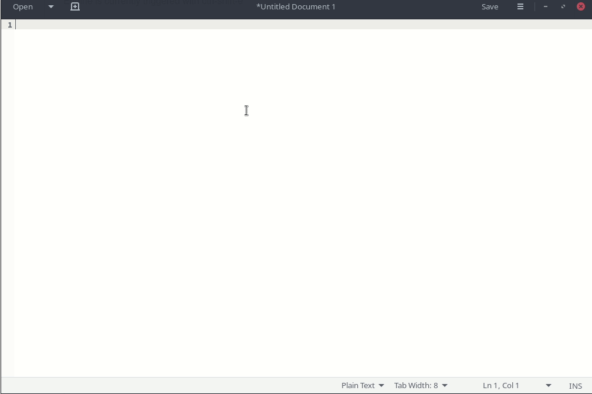

# IBus plugin for the memes

This ibus plugin is written for the sole purpose of letting me type dumb stuff faster. For the most part it acts as an up to date emoji database, but also has a copule other replacements based off what I find useful.

Engine is currently triggered with ctrl-shift-e

If built in debug mode the engine will not be automatically loaded and needs to be set with a `set_global_engine` call to ibus. If built in release mode update the XML file with the path to the release build and drop it into /usr/share/ibus/component

